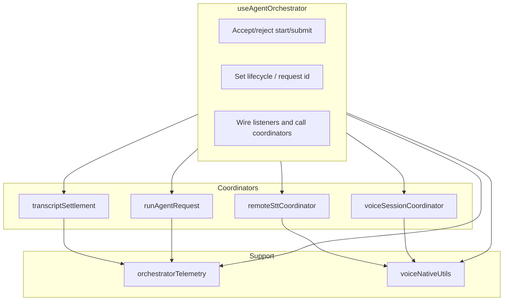

# Orchestrator extraction plan

## Principle

- **Decision layer stays** in the orchestrator: accept/reject start listening, accept/reject submit, set lifecycle, set current request id, wire listeners, call out to coordinators, commit resulting state transitions.
- **Mechanism layer leaves**: any chunk with its own timers, refs, and internal invariants becomes its own module.
- All new modules live under `src/app/agent/`; no new top-level folders (per ARCHITECTURE).

---

## Ownership and coupling rules

**Coordinators own their own internal refs and timers whenever possible.** The orchestrator should only pass in shared semantic callbacks and a very small set of shared refs (e.g. `recordingSessionRef`, `activeRequestIdRef`) where truly necessary. Avoid “dependency bags” that pass many refs into coordinators—that moves complexity without reducing coupling.

**Ownership rule**

- **Coordinators own their own internal refs/timers whenever possible.** Settlement owns settlement timers. Remote STT owns its wait/poll state. Request runner owns its per-request throttling refs. Shared semantic refs remain in the orchestrator only when they are truly cross-flow (e.g. `recordingSessionRef`, `activeRequestIdRef`). Avoid "dependency bags" that pass many refs into coordinators—that moves complexity without reducing coupling.
- **Extracted modules may not become second lifecycle owners.** See lifecycle authority below.

**Lifecycle authority (explicit)**

- **transcriptSettlement.ts** may not become a second lifecycle owner. It owns timer cleanup and transcript-settlement cleanup only; lifecycle/mode commits stay in the orchestrator via callbacks.
- **runAgentRequest.ts** may not directly own top-level lifecycle/mode truth. It is operational only; the orchestrator commits state from runner callbacks.
- **voiceSessionCoordinator.ts** owns audio-session mechanics (state refs, iOS grace, restart guard), not app lifecycle semantics. Side effects that affect mode/lifecycle are callbacks from the orchestrator.

**Incremental execution.** Do not extract all six subsystems in one pass. Follow the order. Settlement first is the litmus test: if that extraction lands cleanly, the rest of the plan is likely sound; if it turns messy, adjust before touching request execution.

**Behavior preservation per phase.** After each extraction, existing orchestrator contract tests must pass and the app must remain behaviorally equivalent unless the phase explicitly states otherwise.

---

## Extraction order and scope

### 1. Transcript settlement (first)

**New module:** `src/app/agent/transcriptSettlement.ts`  
**API shape:** `createTranscriptSettlementCoordinator(deps)` returning `finalizeTranscriptFromPartial`, `finalizeStop`, `resolveSettlement`, plus any hooks the orchestrator needs to drive settlement from voice events.

**Settlement owns:** All settlement-specific refs and timers: `quietWindowTimerRef`, `tailGraceTimerRef`, `tailGraceSessionIdRef`, `finalStabilizationTimerRef`, `finalStabilizationActiveRef`, `finalCandidateTextRef`, `finalCandidateSessionIdRef`, `flushBoundaryAnchorAtRef`, `settlementResolvedRef`, `lastSettledSessionIdRef`, `finalizeTimerRef`, `finalizeInFlightRef`. Constants: `POST_SPEECH_END_QUIET_WINDOW_MS`, `POST_FINAL_STABILIZATION_WINDOW_MS`, `POST_STOP_FLUSH_WINDOW_MS`, `ANDROID_TAIL_GRACE_MS`.

**Lifecycle authority:** Settlement must **not** own lifecycle or mode. It owns timer cleanup and transcript-settlement cleanup. `finalizeStop` after extraction: (1) clears all settlement-owned timers and resets settlement-owned refs, (2) calls transcript fallback (e.g. `finalizeTranscriptFromPartial`) and any settlement-specific listener (e.g. `onListeningEnd`), (3) invokes an **orchestrator-provided callback** for “finalize complete” so the orchestrator can optionally commit lifecycle/mode (e.g. set idle). The orchestrator remains authoritative for final lifecycle/mode commits unless that callback explicitly delegates; settlement never calls `setLifecycle` or `setMode` directly.

**Orchestrator passes in:** Callbacks only: `updateTranscript`, `setAudioState` (for settlement-driven transitions like settling → idleReady), `onTranscriptReadyForSubmit`, optional `transcribeCapturedAudioIfNeeded`, `emitRecoverableFailure`. Shared refs only where unavoidable: e.g. `recordingSessionRef`, `pendingSubmitWhenReadyRef`, `pendingSubmitSessionIdRef` for session identity and submit-intent—prefer passing `recordingSessionId` as an argument to `resolveSettlement(reason, recordingSessionId)` rather than giving settlement a ref to the whole session bag.

**Helpers:** `transcriptTrace`, `transcriptPreview`, `normalizeTranscript` used only by settlement can live in the settlement module or a tiny shared transcript util.

**Expected tests:** `src/app/agent/transcriptSettlement.test.ts` — quiet window expiry; flush boundary expiry; Android tail grace branch; final vs partial candidate selection; empty transcript recoverable failure.

---

### 2. Remote STT coordinator (second)

**New module:** `src/app/agent/remoteSttCoordinator.ts`  
**API shape:** Coordinator that implements the **remote STT mechanism only**: wait for captured audio (poll/timeout), call remote transcribe, normalize and apply transcript or call failure callback. It does **not** own or decide STT provider policy; the orchestrator calls it only when the orchestrator has already decided remote STT is the active provider.

**Remote STT owns:** Its own polling/waiting state and any refs used only for “pending capture” and timeout. Constants: `REMOTE_STT_CAPTURE_WAIT_MS`, `REMOTE_STT_CAPTURE_POLL_MS`. Logic: wait loop, `transcribeAudio` call, normalization, success path (expose result via callback), failure path (single “onRemoteSttFailed” callback so orchestrator sets error/lifecycle).

**Orchestrator:** Decides provider (e.g. `getSttProvider() === 'remote'`). When remote, orchestrator passes in “pending capture” (e.g. from `sttAudioCapture.endCapture`) or a getter; coordinator does not own provider selection.

**Expected tests:** `src/app/agent/remoteSttCoordinator.test.ts` — waits for pending capture; times out cleanly; normalizes transcript on success; failure shaping callback path.

---

### 3. Request pipeline runner (third)

**New module:** `src/app/agent/runAgentRequest.ts`  
**API shape:** `runAgentRequest(question, options)` where options are callbacks and a minimal set of refs (e.g. `activeRequestIdRef` for staleness). Returns `Promise<{ committedText; validationSummary } | null>` (null on staleness or terminal failure).

**Hard rule: no direct React state mutation.** The runner must **not** mutate React state directly. It may only communicate via callback interfaces. The orchestrator remains the single place that commits the final top-level state model. The runner is operational, not semantic. It emits events/callbacks such as:

- `onProcessingSubstateChange`
- `onPartialText`
- `onValidationSummary`
- `onSettled`
- `onTerminalFailure`

The orchestrator subscribes and commits `setProcessingSubstate`, `setResponseText`, `setValidationSummary`, `setMode`, `setLifecycle`, `setError`, etc.

**Runner owns:** Throttling refs (`firstChunkSentRef`, `lastPartialEmitAtRef`, `lastResponseTextUpdateAtRef` per request or internally), pack init and `ragAsk` execution, and all RAG/streaming logic. It does not own lifecycle or mode.

**Expected tests:** `src/app/agent/runAgentRequest.test.ts` — stale request ignored; partial throttling behavior; empty-output fallback; terminal failure callback path; playback handoff vs request_complete path.

---

### 4. Audio session / stop–start guard machine (fourth)

**New module:** `src/app/agent/voiceSessionCoordinator.ts`  
**API shape:** Owns audio session state and platform-specific stop/start guards. Exposes `getAudioState`, `setAudioState` (internal ref only), `shouldBlockStart()`, and iOS stop grace + native restart guard. Orchestrator holds `voiceRef` and calls native start/stop; coordinator answers “can start?” and “invoke stop now vs after grace.”

**Coordinator owns:** `audioStateRef`, `nativeRestartGuardUntilRef`, `iosStopGraceTimerRef`, `iosStopPendingRef`, `iosStopInvokedRef`. Constants: `IOS_STOP_GRACE_MS`, `NATIVE_RESTART_GUARD_MS`. No lifecycle/mode—only “audio session” state and guard semantics; side effects (e.g. “on transition to idleReady”) are callbacks from the orchestrator.

**Expected tests:** `src/app/agent/voiceSessionCoordinator.test.ts` — start blocked by state/guard; iOS stop grace; native restart guard; stopping/listening transitions.

---

### 5. Telemetry helper (thin layer)

**New module:** `src/app/agent/orchestratorTelemetry.ts`  
**API shape:** Thin wrappers only: e.g. `emitRequestDebug(sinkRef, payload)`, `emitLifecycle(logLifecycle, ...)`, `emitRecoverableFailure(...)`. One-liners that call `requestDebugSinkRef?.current?.(...)` and/or `logInfo`/`logLifecycle`.

**Constraint:** `orchestratorTelemetry.ts` is readability-only and must not introduce new semantic interpretations. No helper drift; no silent policy layer. It is a readability extraction only; no “helper drift.”

---

### 6. Native Voice / TTS adapter utilities

**New module:** `src/app/agent/voiceNativeUtils.ts`  
**Move:** `getVoiceNative()`, `getOnDeviceModelPaths()`, `errorMessage`, `isRecognizerReentrancyError`, `blockWindowUntil`, `isRecoverableSpeechError`. Shared transcript helpers (e.g. `normalizeTranscript`, `transcriptPreview`) in one place (e.g. small `transcriptUtils.ts` or inside settlement if only settlement needs them).

**Expected tests (voiceNativeUtils.ts):** Low-risk unit tests only where logic is nontrivial (e.g. recognizer reentrancy, recoverable speech error patterns).

---

## Test placement rule

- Every extracted module must land with a **neighboring `*.test.ts` file** in `src/app/agent/` (e.g. `transcriptSettlement.test.ts` next to `transcriptSettlement.ts`).
- `src/app/agent/tests/` remains for **broader orchestrator contract/integration tests only**.
- No extraction is complete without local unit tests for that module **plus** passing orchestrator contract tests.

## Behavior preservation and tests (summary)

- **After each extraction:** Existing orchestrator contract tests must pass; the app must remain behaviorally equivalent unless the phase explicitly states otherwise.

**Codified test expectations per module:**

- **transcriptSettlement.test.ts:** quiet window expiry; flush boundary expiry; Android tail grace branch; final vs partial candidate selection; empty transcript recoverable failure.
- **remoteSttCoordinator.test.ts:** waits for pending capture; times out cleanly; normalizes transcript on success; failure shaping callback path.
- **runAgentRequest.test.ts:** stale request ignored; partial throttling behavior; empty-output fallback; terminal failure callback path; playback handoff vs request_complete path.
- **voiceSessionCoordinator.test.ts:** start blocked by state/guard; iOS stop grace; native restart guard; stopping/listening transitions.
- **voiceNativeUtils.ts:** low-risk unit tests only where logic is nontrivial (e.g. recognizer reentrancy, recoverable speech error patterns).
- **orchestratorTelemetry.ts:** no new semantics; optional tests that helpers forward to existing sink/log (readability only).

---

## Dependency diagram (after extractions)

Orchestrator wires settlement and remote STT (e.g. passes `transcribeCapturedAudioIfNeeded` from remote STT into settlement as callback). No direct settlement → remoteStt dependency required.

---

## File layout (summary)

| New/updated file | Purpose |
|------------------|--------|
| `src/app/agent/transcriptSettlement.ts` | Settlement coordinator: quiet window, flush boundary, final vs partial candidate, finalizeStop (timer/ref cleanup + callback for lifecycle), resolveSettlement. Owns all settlement refs/timers. |
| `src/app/agent/remoteSttCoordinator.ts` | Remote STT mechanism only; provider selection stays in orchestrator. Wait for capture, transcribe, normalize, success/failure callbacks. |
| `src/app/agent/runAgentRequest.ts` | Run one RAG request via callbacks only; no direct React state. Owns throttling refs and RAG execution. |
| `src/app/agent/voiceSessionCoordinator.ts` | Audio session state and iOS/Android stop grace and restart guard. Owns session refs/timers. |
| `src/app/agent/orchestratorTelemetry.ts` | Readability-only wrappers; no new event semantics. |
| `src/app/agent/voiceNativeUtils.ts` | getVoiceNative, getOnDeviceModelPaths, errorMessage, recognizer/recoverable checks, blockWindowUntil. |
| `src/app/agent/useAgentOrchestrator.ts` | Decision layer, wiring, minimal shared refs, calls to coordinators. |

---

## Implementation notes

- **Refs:** Coordinators own internal refs/timers. Orchestrator passes only shared semantic refs (e.g. `recordingSessionRef`, `activeRequestIdRef`) when truly necessary; prefer passing values (e.g. `recordingSessionId`) into coordinator methods.
- **Callbacks:** Coordinators receive callbacks for any side effect that touches lifecycle, mode, or UI state; they do not import React or mutate orchestrator state directly.
- **No dependency version changes** (per user rule); structural refactor only.
