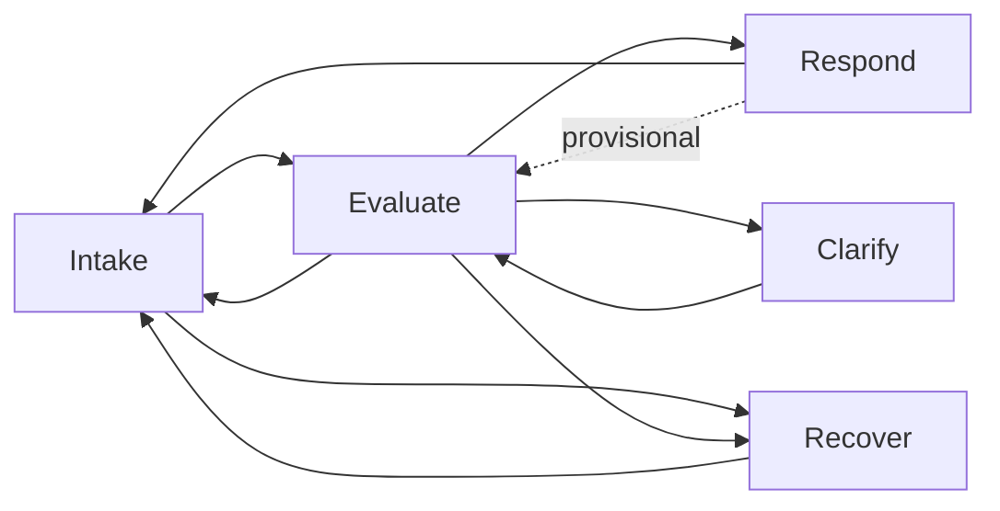
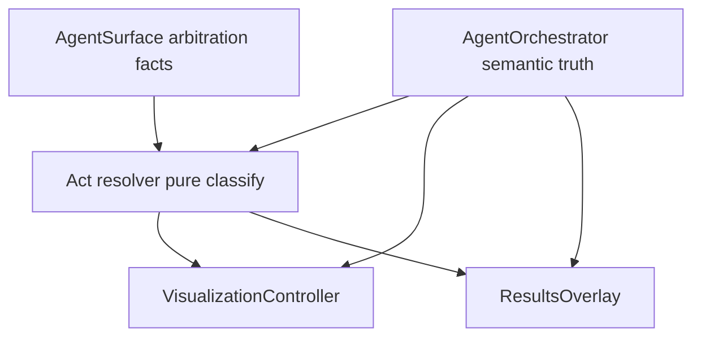

# Play/Act control-layer contract

**Cycle 4 — conceptual contract (canonical).** This document defines a minimal, data-driven **Play/Act** layer: a **derived** interaction-phase grammar that classifies the current moment from **normalized orchestrator truth** and **surface-visible facts**, and constrains how **presentation** interprets that moment. It does **not** replace lifecycle, input arbitration, or semantic meaning.

**Authority (must stay aligned with):**

- [docs/ARCHITECTURE.md](ARCHITECTURE.md) — orchestrator as single lifecycle / semantic owner; AV/request as mechanism.
- [docs/APP_ARCHITECTURE.md](APP_ARCHITECTURE.md) — four roles; normalized event flow.
- [docs/INTERACTION_CONTRACT.md](INTERACTION_CONTRACT.md) — InteractionBand ↔ AgentSurface hold semantics.

---

## Scope

**In scope:** Act schema, minimal Act set, resolution inputs, transitions, commit alignment, resume/replace semantics, mapping to existing owners, validation rules, implementation watchpoints.

**Out of scope:** Orchestrator implementation, new subsystems, visualization internals, debug/diagnostics, concrete hooks or file layout (those follow this contract when introduced). **Realization:** [docs/PLAY_ACT_REALIZATION.md](PLAY_ACT_REALIZATION.md). **Hardening / expansion boundaries:** [docs/PLAY_ACT_BOUNDARIES.md](PLAY_ACT_BOUNDARIES.md).

---

## Constraints

**Non-negotiable rules:**

- **Semantic truth and lifecycle** (`idle` | `listening` | `processing` | `speaking` | `error`, `processingSubstate`, request-scoped transitions, commit/clear of results) remain owned by **AgentOrchestrator** only. Acts **read** these; they **never** author them.
- **Input arbitration** (band enablement, priority order debug > overlay > holdToSpeak > swipeContext > playbackTap > none) and **semantic hold accept/reject** remain owned by **AgentSurface** (and **InteractionBand** for touch intent only per [INTERACTION_CONTRACT.md](INTERACTION_CONTRACT.md)). Acts **read** arbitration-relevant facts where exposed; they **never** override acceptance, reject holds, or re-rank arbitration.
- **Visualization** maps normalized agent state → signals/events through **VisualizationController**; **ResultsOverlay** presents grounded content. Acts **do not** drive `applyVisualizationSignals`, scene motion, or overlay layout as an authority; at most they supply **labels/constraints** presentation may use so it stays aligned with the same truth the controller already sees.
- **Mechanism layers** (AV facts → single orchestrator ingress `applyAvFact`, request runner) are unchanged; Acts **do not** emit AV facts or substitute for request execution.
- Play/Act is **not** a parallel state machine that **competes** with lifecycle: it is a **derived phase view** plus **declarative constraints on how presentation interprets** the current moment. Invalid Act transitions **cannot** force orchestrator transitions; orchestrator truth **invalidates** Act classifications when they disagree.

---

## Act schema

Each **Act** is a **declarative record** (data, not behavior) with:

| Field | Purpose |
|--------|--------|
| **identity** | Stable Act id (one of the minimal set below). |
| **triggerSource** | Which **normalized signal classes** may select this Act (see Act resolution). Triggers are **predicates over published facts**, not computed semantics. |
| **allowedAffordances** | **Declarative** set of **user-facing interaction classes** that presentation may treat as **in-play** for this phase (e.g. primary voice intake, supplemental utterance, retry-after-soft-fail, playback gestures). These **must remain consistent** with orchestrator lifecycle and surface arbitration: they are **eligibility hints for UX copy/layout**, not **gates**. If arbitration or lifecycle blocks an affordance, **authority wins**; Act affordances **shrink** to the intersection. |
| **transitionRules** | **Outgoing** Act edges keyed by **normalized outcome classes** (lifecycle edges, request settled/failed/recovered, clarification-needed flag from orchestrator-emitted outcome if present, etc.). Rules are **data** (“on outcome O, next Act is A′ or stay”), not imperative controllers. |
| **commitmentPolicy** | Per-Act rules for **how presentation should treat** `responseText` / grounded payload / visibility (see Commit policy). **Commitment of text and clearing** remain **orchestrator-owned**; policy only **describes** visibility and staleness rules for UI. |
| **terminality** | **terminal** — Act is a **stable end-of-play** slice until a **new intentional user play** (e.g. new submit) resets phase context; **resumable** — Act expects **continuation** within the same conversational play without a full reset. |

---

## Act set

**Five Acts** (minimal coverage; intentional non-splitting):

1. **Intake** — User may supply **primary** spoken input (hold-to-speak path when lifecycle and arbitration allow). Covers `listening` and **idle** states that are **ready for** a new hold attempt (not hard `error`, not blocked by overlay/debug per surface rules). *User input / intake.*

2. **Evaluate** — **Interpretation / evaluation** in flight: lifecycle `processing` (retrieval/generation). *No duplicate sub-states for retrieval vs generation unless already expressed by `processingSubstate` as a read-only discriminator.*

3. **Clarify** — **Supplemental** user input is expected **before** the current play can proceed to a final grounded response, per **orchestrator-emitted outcome class** (e.g. needs-clarification / insufficient-spec). Lifecycle may still be `idle` or `listening` depending on product wiring; Act **does not** decide *why* clarification is needed. *Clarification.*

4. **Recover** — **Recovery** window after **recoverable** failure (e.g. empty transcript → `idle`, soft-fail signal, or post–request-failure idle with cleared stale results per orchestrator policy). User may **retry** without entering hard `error`. *Recovery.*

5. **Respond** — **Answer / response** phase: grounded content **committed** by orchestrator is **the** active result for the play; may include `speaking` and post-play **idle with retained** visible answer until user dismisses or starts a new play per overlay rules. *Answer / response.*

---

## Act resolution

**Inputs (read-only, normalized):**

- Orchestrator **lifecycle** and **`processingSubstate`** (when `processing`).
- Orchestrator **request phase facts**: none / in-flight / settled success / settled failure / recovered / blocked (expressed however the orchestrator already publishes—Act layer **consumes** the same classes the UI would need today).
- Orchestrator **outcome / intent flags** that are **already committed** (e.g. clarification required, recoverable listen failure vs hard error). Acts **never** infer these from raw transcripts or RAG internals.
- Surface-visible **arbitration snapshot** only as needed to **disambiguate** presentation (e.g. overlay owns interaction—Act may still classify **Recover** vs **Respond** from orchestrator truth; arbitration explains why **Intake** affordances are off without changing Act id).

**Resolution locus (conceptual):**

- A **single Act resolver** runs **after** orchestrator (and surface, for composition order) has produced the current **published truth**. It is a **pure function** of those facts → **at most one primary Act** (plus optional read-only `processingSubstate` passthrough for presentation).

**Non-computation rule:**

- Acts **do not** compute embeddings, retrieval quality, or “what the user meant.” They **only classify** the **already-normalized** control/outcome surface.

**Precedence (when multiple triggers could match):**

- **Hard `error`** dominates: Act resolution may map to a **presentation-facing ErrorMoment** (still **not** lifecycle owner)—or **exclude** Intake/Evaluate/Respond until recovery path exists; exact UX is presentation, but **lifecycle `error`** remains orchestrator truth.
- **In-flight request** (`processing`) → **Evaluate** overrides Intake/Respond unless orchestrator explicitly publishes a superseding terminal outcome (should not occur without lifecycle change).
- **Clarify** is selected only when orchestrator (or its committed outcome channel) **asserts** clarification-needed; otherwise prefer **Intake** or **Evaluate**.

---

## Transitions

**Valid directed transitions** (edges are **outcomes**, not user whims):

**Diagram note:** **Respond → Evaluate** is **not** part of the canonical transition set until (and unless) the **concrete exported orchestrator control contract** exposes a fact that genuinely requires it (e.g. chained in-flight work without a user intake step). Default assumption remains **single active ask** and **Respond → Intake** (or **Respond → Evaluate** only via a new user submit through **Intake**).

**Edge meanings (conceptual):**

- **Intake → Evaluate** — Submit accepted; request in flight.
- **Intake → Recover** — Recoverable listen/submit path failed before a request (e.g. no usable transcript); lifecycle back to idle-ready.
- **Evaluate → Respond** — Successful settlement with grounded response committed.
- **Evaluate → Clarify** — Orchestrator commits “need clarification” outcome; play continues, same overarching play id if the orchestrator exposes one.
- **Evaluate → Recover** — Request failed with recoverable policy; orchestrator clears/fails per existing rules.
- **Evaluate → Intake** — Cancellation / interruption that returns to ready-to-capture without a final response (orchestrator-defined).
- **Clarify → Evaluate** — User supplies clarification; new or continued request enters `processing`.
- **Recover → Intake** — Idle-ready after soft fail or explicit recovery; user may retry.
- **Respond → Intake** — New play (new submit) or explicit reset that clears prior response context per orchestrator.
- **Respond → Evaluate** — **Provisional only.** Do **not** treat as a committed edge when moving to implementation unless the **exported control contract** includes an explicit, stable signal that this transition is real (e.g. backend-chained processing without user intake). Until then, assume **no direct Respond → Evaluate**; any return to **Evaluate** goes **Intake → Evaluate** after user submit. If the contract never requires it, **omit** this edge from the Act graph entirely.

**Terminal vs resumable:**

- **Terminal (for the play slice):** **Respond** after success settlement until a **new play** or orchestrator-driven clear—terminal in the sense of “answer is the stable outcome of this play.”
- **Resumable:** **Clarify**, **Recover**, and **Intake** (when in continuation context) are **resumable** within the same conversational play.
- **Evaluate** is **resumable** only as “in progress”; it **terminates** into Respond, Clarify, Recover, or Intake on settlement/cancel.

**Retry / continuation:**

- **Retry** after **Recover** returns to **Intake** (same global session; **replace** semantics for stale result context follow orchestrator clear rules).
- **Continuation** in **Clarify** preserves **conversational play** until clarification is satisfied or user abandons (orchestrator cancel → Intake/Recover per policy).

---

## Commit policy

**Global rule:** **When** `responseText` and grounded payloads are **committed**, **updated**, or **cleared** is defined **only** by **AgentOrchestrator** (and existing request/overlay wiring). Acts describe **presentation alignment**, not **storage**.

| Act | responseText / grounded payload (presentation view) |
|-----|-----------------------------------------------------|
| **Intake** | **Uncommitted** or **prior play hidden** per orchestrator (e.g. new play). No reliance on Acts to clear—orchestrator already clears on failures per [APP_ARCHITECTURE.md](APP_ARCHITECTURE.md). |
| **Evaluate** | **Provisional** streaming may exist for UI that shows partials **only if** orchestrator already exposes them; default **no final answer chrome** until settlement. |
| **Clarify** | **Prior partial or prompt context** visible per product **only if** orchestrator/surface already expose it; Act marks “supplemental input expected.” |
| **Recover** | **Cleared or stale-hidden** per orchestrator failed-request recovery; soft-fail may allow **empty** answer panel. |
| **Respond** | **Committed** visible answer; **speaking** may track playback lifecycle; dismiss/reveal remains **ResultsOverlay** local state within orchestrator-fed bounds. |

**Visibility vs hidden:**

- **Hidden** vs **revealed** panel state is **ResultsOverlay / surface** local presentation; Acts only **tag** which Act **expects** answer vs no-answer chrome so presentation does not contradict lifecycle.

---

## Resume vs replace

**Replace (new play):**

- Orchestrator **new submit** after settlement or after **failed-request recovery** that clears result context → **new play**; Act moves toward **Intake** then **Evaluate**; prior **Respond** context is **not** continued unless orchestrator explicitly retains (default **replace** per single-active-ask semantics in [APP_ARCHITECTURE.md](APP_ARCHITECTURE.md)).

**Resume (same play):**

- **Clarify** → user speaks again → **Evaluate** without treating the thread as a brand-new session **if** orchestrator keeps **request/play continuity** (consumes orchestrator’s request id / continuation flag if present).
- **Recover** → **Intake** is **resume** at “try again,” not continuation of partial answer.

**Clarification:**

- **Clarify** always **resumes** pending **evaluation** of the **same user goal** until orchestrator exits clarification state.

**Recovery:**

- **Recover** **replaces** the **failed attempt’s** visible outcome with **empty/idle** presentation per orchestrator; **does not** auto-resume partial generation.

---

## Act mapping

| Layer | Relationship to Acts |
|--------|----------------------|
| **Lifecycle (orchestrator)** | **Source of truth** for which Act candidates are **valid**. Acts **map from** lifecycle + outcome; they **never** emit lifecycle transitions. |
| **Surface arbitration** | **Source of truth** for whether **Intake** affordances are **physically** available. Acts **intersect** declared affordances with arbitration + lifecycle. |
| **VisualizationController** | **Unchanged authority**: maps **orchestrator** state → signals. Acts **optional**: may provide a **phase label** consumed alongside lifecycle for **copy/timing** only, **not** new signal sources. |
| **ResultsOverlay** | **Unchanged authority** for reveal/dismiss/layout. Acts inform **what class of content** is expected (answer vs none vs clarification prompt) **without** owning props. |

**Position in the stack:** Acts sit **between semantic truth and presentation** as an **interpretive grammar**—**downstream** of orchestrator and arbitration facts, **upstream** of purely visual/layout decisions—**without** superseding either.

---

## Final model

**One sentence:** **AgentOrchestrator** (and **AgentSurface** arbitration facts) publish **normalized control truth**; the **Act resolver** **classifies** the current moment into **exactly one primary Act** and **declarative policies**; **VisualizationController** and **ResultsOverlay** remain the **only** owners of how that truth becomes pixels, optionally **constrained** by Act so interaction phases stay **consistent** and **unambiguous** for users.

---

## Implementation watchpoint

- **Respond → Evaluate:** Keep **provisional**. Revisit only after the **concrete exported orchestrator control contract** is fixed; add the edge **if and only if** that contract **requires** it. Otherwise leave it out to avoid a second, speculative interpretation path.

---

## Validation check

- **No second control system:** Acts **do not** schedule requests, start/stop listening, accept holds, or write visualization refs; they **classify** and **constrain interpretation** only.
- **No ownership violations:** Lifecycle, request commit/clear, arbitration, and hold semantics stay with **orchestrator** / **surface** / **band** as documented.
- **No lifecycle duplication:** Act transitions are **labeled reactions** to orchestrator outcomes, **not** a second `idle|listening|…` machine that could diverge.

---

## Stop conditions (contract design)

- **GOVERNANCE CONFLICT:** Would occur if Play/Act owned lifecycle, arbitration, or semantic meaning in parallel with the documented owners.
- **NOT POSSIBLE WITHOUT VIOLATION:** Not claimed by this contract—the design stays derived and declarative.
