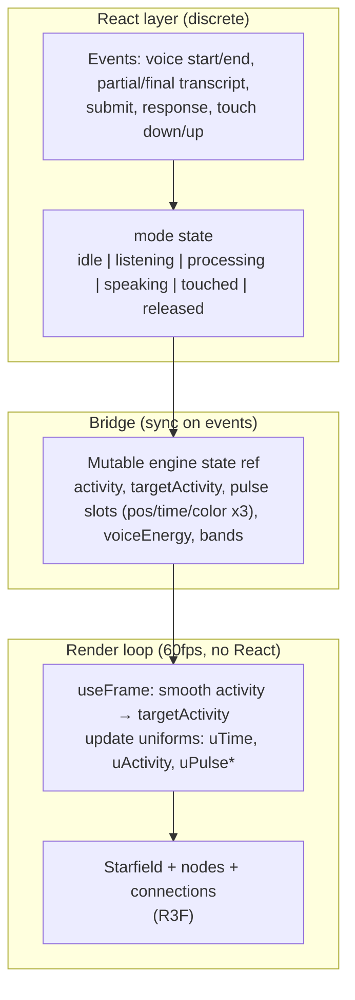

# App Architecture: Node Map and Voice Screen

## High-level architecture

- **Entry**: `App.tsx` — `SafeAreaProvider` → `VoiceScreen` (single screen, no navigation).
- **VoiceScreen**: Renders (1) **NodeMapCanvas** fullscreen (absolute) as background, and (2) the **Voice UI** overlay (ScrollView with status, question/response, buttons). VoiceScreen owns `mode` state and the **engine ref** (`vizRef`); it passes the ref into the canvas so the scene can read it in `useFrame`.
- **Data flow**: User and system events (voice start/end, partial/final transcript, submit, response, touch) → **mode** state + writes to **engine ref** → render loop (`useFrame`) reads ref, smooths activity, updates uniforms → **shaders** (starfield, nodes, connections) drive the “connect the dots” look.

---

## Low-level: engine state and scene

### Engine state ref (single mutable object)

- **Who writes**: React (on mode change → `targetActivity`); event handlers (`triggerPulseAtCenter` → pulse slots); mic button touch → `touchActive`, `touchWorld`; DevPanel → palette/easing/viz toggles.
- **Who reads**: Only the render loop (`useFrame` in EngineLoop, StarfieldPoints, NodeCloudPoints, ConnectionLines). No React state is set from the ref.

Fields:

- `clock` — elapsed time (written in useFrame).
- `activity`, `targetActivity` — smoothed 0..1; target set from mode.
- `pulsePositions[3]`, `pulseTimes[3]`, `pulseColors[3]`, `lastPulseIndex` — pulse slots for discrete events.
- `voiceEnergy`, `bands` — optional RMS/FFT (not yet wired).
- `activityLambda`, `lambdaUp`, `lambdaDown` — easing rates.
- `paletteId`, `hueShift`, `satBoost`, `lumBoost` — palette (DevPanel).
- `showViz`, `showConnections`, `starCountMultiplier` — viz toggles.
- `touchActive`, `touchNdc`, `touchWorld`, `touchInfluence` — touch state; shaders use sentinel or `uTouchInfluence == 0` when no touch.

### useFrame responsibilities

- **EngineLoop**: Advance `clock`; framerate-independent easing: `k = 1 - exp(-lambda * dt)`, `activity += (targetActivity - activity) * k` (lambda = lambdaUp or lambdaDown); ease `touchInfluence` toward 1 when touch active, 0 when not. Clamp `activity` to [0,1]; cap `dt` to avoid spikes after background.
- **StarfieldPoints / NodeCloudPoints / ConnectionLines**: Update `uTime`, `uActivity`, pulse uniforms (and in nodes, `uTouchWorld`, `uTouchInfluence`) from the ref.

### Scene layout

- **Starfield**: `Points` with position/color/size; vertex/fragment shaders use `uTime` for twinkle.
- **Node cloud**: `Points` from one formation (Crystalline Sphere); attributes: position, nodeSize, nodeType, nodeColor, distanceFromRoot. Vertex: breathing, leaf drift (fuzzy sphere), `getPulseIntensity`; fragment: soft point, glow. **uActivity** scales opacity/glow (“connect the dots”).
- **Connections**: Precomputed **LineSegments** (bezier-sampled curves); attributes: position, t, startPoint, endPoint, connectionStrength, pathIndex, connectionColor). Shader: flow along path, pulse, **uActivity** for visibility. Geometry built once; no per-frame regeneration.

### Uniforms (driven from ref / useFrame)

- From ref: `uActivity`, `uPulsePositions[3]`, `uPulseTimes[3]`, `uPulseColors[3]`, `uTouchWorld`, `uTouchInfluence`.
- From useFrame time: `uTime`.
- “Connect the dots” is implemented only in shaders via `uActivity` and pulse intensity.

---

## State table (six states)

| State              | When                    | React state (discrete)   | Engine ref targets (on enter)   |
|--------------------|-------------------------|--------------------------|----------------------------------|
| **Idling**         | Default, no voice       | `mode: 'idle'`           | `targetActivity = 0.1`           |
| **Listening**      | Mic on, voice active    | `mode: 'listening'`       | `targetActivity = 0.6`           |
| **Thinking**       | Submit → RAG working    | `mode: 'processing'`      | `targetActivity = 1.0`           |
| **Talking**        | TTS speaking            | `mode: 'speaking'`        | `targetActivity = 0.7`           |
| **Being Touched**  | User finger down (e.g. mic button) | `mode: 'touched'`  | `targetActivity = 0.5`           |
| **Being Released** | User releases           | `mode: 'released'`        | Brief; then startListening → listening |

- **isRecording** is derived: `mode === 'listening'` (single source of truth for “mic is recording”).
- **Busy lock**: When `mode === 'processing'` or `mode === 'speaking'`, `startListening()` is blocked and Submit is disabled.

---

## Recording contract and question context

- **React state**: `transcribedText` (committed + final text), `partialText` (draft while listening), `mode`, `recordingSessionId` (monotonic ref for session guard). Submit uses `transcribedText.trim().replace(/\s+/g, ' ')` as the question.
- **Preflight**: Before `Voice.start()`, busy lock is checked; mic permission can be added (plan: if denied, mode idle, error earcon, inline message).
- **Session guard**: `modeRef.current === 'listening'` is checked in `onSpeechResults`, `onSpeechPartialResults` so late events after stop do not overwrite state. `recordingSessionIdRef` is incremented on each `startListening()` for logging.
- **Lifecycle**: `startListening()` → setMode('listening'), start auto-stop timer; `onSpeechEnd` → setMode('idle'), play listen-out earcon; `onSpeechError` → setMode('idle'), play error earcon. `stopListening()` clears timer and calls `Voice.stop()`.
- **Earcons**: Listen-in when recording actually begins (after `Voice.start()`); listen-out on `onSpeechEnd`; error on `onSpeechError`. Currently stubbed (console.debug); character: listen-in = short rising chirp, listen-out = short falling chirp, error = soft double blip.
- **Visual confirmation**: “Listening…” and mic button state indicate recording.
- **Cleanup**: On unmount, auto-stop timer is cleared, `Voice.destroy()` and `removeAllListeners()` are called. On app background, `AppState` listener calls `stopListening()` so the mic does not stay on.
- **Auto-stop**: `maxListenMs` (e.g. 12s) timer; when it fires while still listening, `stopListening()` is called.
- **Touch policy**: Touch on mic button sets mode touched and viz touch state; release toggles start/stop listening. Touch does not change recording state except via that button.

---

## Touch raypicker + attractor

- **Engine ref fields**: `touchActive`, `touchNdc`, `touchWorld`, `touchInfluence` (eased in render loop).
- **Current behavior**: Mic button press sets `touchActive = true`, `touchWorld = [0,0,0]`; release sets `touchActive = false`, `touchWorld = null`. Full 3D raypicker (R3F Raycaster) can be added so touch on canvas sets `touchWorld` to hit point.
- **Shader null safety**: When `touchWorld` is null, the scene passes a sentinel (e.g. `1e6`) to the shader; node shader gates touch boost with `uTouchInfluence` and distance so no NaNs or full-screen glow.

---

## RAG and transcript chokepoints

- **ask() throw**: Set mode to idle, set error UI, log `[RAG] error` with `requestId`; optional error earcon / warning pulse can be added.
- **validationSummary**: When unknownCardCount or invalidRuleCount > 0, response is annotated (validation hint in UI) and we log `[RAG] requestId=… validationSummary=…`.
- **Transcript**: Submit uses `questionText` (here: `transcribedText`) trimmed and whitespace collapsed; submit is no-op if empty. `onSpeechResults`: use first element of `value` array deterministically.
- **requestId**: Monotonic ref incremented per submit; included in all RAG logs.

---

## DevPanel validation

- **Gate**: Long-press on “Voice to text” header toggles `devEnabled`; when true, DevPanel overlay is shown.
- **Clamping when writing to ref**: activityLambda, lambdaUp, lambdaDown ∈ [0.5, 20]; hueShift ∈ [-0.1, 0.1]; satBoost, lumBoost ∈ [0.5, 1.5]; starCountMultiplier ∈ [0.1, 3]. DevPanel uses these ranges so sliders/buttons cannot write invalid values.

---

## Log structure

- **Prefixes**: `[NodeMap]`, `[Voice]`, `[RAG]` for filterable timeline.
- **Voice**: recordingSessionId can be included in voice-related logs.
- **RAG**: requestId in every RAG log (submit, result, validationSummary, error).
- **Levels**: Use console.debug / .info / .warn / .error as appropriate.

---

## File map

| Area              | Files / ownership |
|-------------------|-------------------|
| Mode state, engine ref, Voice/RAG wiring | `App.tsx` (VoiceScreen) |
| NodeMapCanvas, scene, useFrame | `src/nodeMap/NodeMapCanvas.tsx`, `EngineLoop.tsx`, `StarfieldPoints.tsx`, `NodeCloudPoints.tsx`, `ConnectionLines.tsx` |
| Shaders           | `src/nodeMap/shaders/starfield.ts`, `nodes.ts`, `connections.ts` |
| Formation / data  | `src/nodeMap/formations.ts`, `starfieldData.ts` |
| Engine types, triggerPulse | `src/nodeMap/types.ts`, `triggerPulse.ts` |
| DevPanel          | `src/nodeMap/DevPanel.tsx` |
| RAG               | `src/rag` (unchanged API; call `ask()`, use result for mode and triggerPulseAtCenter) |
| Audio bridge (optional) | Not implemented; would write RMS/bands into viz ref at 20–30 Hz. |

---

## Easing and DevPanel

- **Activity easing**: `k = 1 - exp(-lambda * dt)`, `activity += (targetActivity - activity) * k`. Separate `lambdaUp` / `lambdaDown` for snappier ramp-up and slower ramp-down.
- **DevPanel**: Only writes into the engine ref (palette, easing, viz toggles); no React state for animation. Render loop already reads these fields.

---

## Reference

The node map visuals and shader logic are adapted from a **Quantum Neural Network**–style reference (starfield + node cloud + connection layers, Node class, Crystalline Sphere formation, pulse uniforms, glass-style UI). Adaptations in this app: **triggerPulseAtCenter** and three pulse slots (no uImpulse scalar); **uActivity** for “connect the dots”; no OrbitControls; touch drives viz only (and mic button toggles listen); single theme (Purple Nebula) by default.
