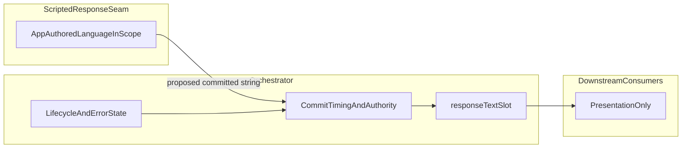

# Scripted Response Seam — Scope and Ownership

Canonical scope and ownership definition for the **Scripted Response Seam**: app/agent semantic output that is **pre-commit**, **non-AV**, and **non-visualization**. This document is **plan-level governance only**—no implementation, schema, or API. **Answer resolution (commit path and merge):** [ANSWER_RESOLUTION.md](./ANSWER_RESOLUTION.md).

**Anchors:** [docs/ARCHITECTURE.md](../../../../docs/ARCHITECTURE.md), [docs/APP_ARCHITECTURE.md](../../../../docs/APP_ARCHITECTURE.md), orchestrator contract in `useAgentOrchestrator.ts` (single `responseText` slot, commit authority).

---

## Preflight: files referenced for classification

Within `src/app/agent/**`, excluding `src/app/agent/av/**` (AV not owned by this seam).

| Area | Files |
|------|--------|
| Answer / request path | `src/app/agent/request/executeRequest.ts` |
| Front-door commit text | `src/app/agent/orchestrator/frontDoorCommit.ts` |
| Semantic channel copy | `src/app/agent/semanticChannelCanonicalCopy.ts` |
| Play/Act shim | `src/app/agent/playActPhaseCopy.ts` |
| Act supplementary copy | `src/app/agent/actDescriptorSemanticChannelHint.ts` |
| Act coherence (tooling) | `src/app/agent/resolveActDescriptor.ts` (validation messages) |
| Error surfacing | `src/app/agent/useAgentOrchestrator.ts` (`setError` call sites) |

**Boundary:** Scope definition does not require owning `visualization/**`, `ResultsOverlay`, RAG/pack/prompt surfaces, or `av/**`.

---

## 1. Scope inventory

App-authored or app-shaped **user-facing language** in the agent layer (excluding AV subtree).

### Answer slot / committed response channel (`responseText` and TTS input)

1. **Model/RAG primary text** — Not app-authored; streaming partials and final `nudged` in `executeRequest.ts`.
2. **Empty settled output fallback** — `EMPTY_RESPONSE_FALLBACK_MESSAGE` when `nudged` trims empty (`executeRequest.ts`).
3. **Front-door blocked committed text** — `clarify_entity`: newline-joined `ambiguous_candidates[].name`; `abstain_*`: empty string (`frontDoorCommit.ts`); orchestrator commits (`useAgentOrchestrator.ts`).
4. **Request terminal failure `displayMessage`** — Exception/code plus optional platform hint (`executeRequest.ts`); `setError(...)` in orchestrator.

### Shell / chrome / semantic channel (not the scrollable answer body)

5. **Phase captions and primary semantic-channel accessibility labels** — `semanticChannelCanonicalCopy.ts`.
6. **Error lifecycle accessibility label** — Prefixes `state.error` for screen readers (`semanticChannelCanonicalCopy.ts`).
7. **Act descriptor semantic channel hint** — Situation gloss by `ActSituationFamily` (`actDescriptorSemanticChannelHint.ts`).
8. **Legacy shim** — `playActPhaseCopy.ts` delegates to (5).

### Orchestrator-surfaced strings (often infra / transport / native)

9. **Hardcoded gate failures** — e.g. missing STT base URL, capture unavailable (`useAgentOrchestrator.ts`).
10. **Forwarded native / proxy errors** — Speech, voice load, TTS, etc. (`useAgentOrchestrator.ts`).
11. **Act descriptor validation issue messages** — Coherence checks (`resolveActDescriptor.ts`); tooling / dev class, not product answer copy.

### Implicit

12. **Future app-authored strings** under `src/app/agent/scripted/**` — Intended home for seam implementation artifacts once added.

---

## 2. Classification (A / B / C / D)

| Ref | Class | Category | Justification |
|-----|--------|----------|---------------|
| 2 | Empty-output fallback | **A** | Pure app-authored text in the answer slot when the pipeline succeeds but model output is empty. |
| 3a | Front-door clarify joined text | **D** | Payload supplies names; app owns delimiter/layout and optional framing; not fully authored prose today. |
| 3b | Front-door abstain empty | **D** | Deliberate absence of copy; policy is app-owned; seam may own “silence” vs future recovery copy. |
| 4 | `displayMessage` on request failure | **C** | Dominated by codes/exceptions/infra hints; behaves as system/transport today. |
| 5–6 | Phase caption + primary a11y + error-prefixed a11y | **B** | State chrome, not primary answer; APP_ARCHITECTURE separates overlay answer from lifecycle/chrome. |
| 7 | Act descriptor semantic channel hint | **B** | Supplementary a11y gloss; not answer slot. |
| 8 | `playActPhaseCopy` | **B** | Same as (5) via shim. |
| 9–10 | Orchestrator `setError` strings | **C** | Voice/STT/proxy/infra; orchestrator owns lifecycle truth. |
| 11 | Act validation messages | **C** (tooling) | Not end-user answer product copy. |
| 1 | Model/RAG text | **Out of seam** | Seam may relate via posture; seam does not own model text. |

---

## 3. Inclusion boundary

### Owned by Scripted Response Seam (in-domain)

- **Answer-slot app-authored language:** fixed fallbacks and declarative **replacement / additive / augmentation** of the **committed answer string** that is not raw model output—starting with **empty-output fallback** and **front-door clarify presentation** (format and optional fixed framing). **Abstain empty** is a **policy outcome** the seam may describe; it need not invent prose.

### Explicitly out of scope

- **B:** Phase captions, Play/Act primary labels, Act situation hints, and other chrome/a11y shell unless product explicitly expands scope.
- **C:** Terminal/infra `displayMessage` / `setError` bodies as currently constituted.
- **AV, visualization, ResultsOverlay:** Consumers **must not** originate canonical copy for seam-owned concerns.

### Deferred (future phases)

- Friendly rewriting of **C** into product voice (would need “code → seam lookup” discipline).
- Whether **B** shares one registry with **A** for copy-revision parity (normalization tradeoff).

---

## 4. Intent taxonomy (high level only; no schema)

Intent **families** the seam may eventually key:

- `clarification_needed` — Disambiguation / specificity (front-door–shaped).
- `answer_empty_or_unavailable` — Successful run, empty `nudged`.
- `scripted_answer` — Fully app-authored body replacing model for a known intent.
- `acknowledgement` — Short confirm/deny if ever committed to the slot.
- `recoverable_soft_fail` — User-safe narrative with text still in the slot (distinct from abstain-empty).
- `session_guidance` — Onboarding/capability hints if committed as answer-slot text (rare; overlaps **D**).
- `system_or_infra_fault` — Reserved if scope later productizes error voice (today **C**, out of seam).

---

## 5. Posture constraints

The seam **conceptually** supports:

- **Replacement** — Committed visible text is wholly app-authored for that intent.
- **Additive** — App text prepended/appended to model output or payload-derived text.
- **Augmentation** — Templated injection, headers, or light transforms around model or payload content.

**Answer resolution governance:** ordering, precedence, **streaming vs settle**, and single-slot invariants are defined in [ANSWER_RESOLUTION.md](./ANSWER_RESOLUTION.md). **Deferred (implementation):** multi-intent arbitration at a single insertion point if product requires it.

---

## 6. Ownership contract

| Layer | Owns |
|--------|------|
| **Scripted Response Seam** | Canonical **wording** (templates/patterns) for **included categories**; stable intent keys at semantic level (schema later). |
| **Orchestrator** | **When** text is committed, **single `responseText` slot**, lifecycle, `error` state, request/front-door **routing**—no duplicate answer stores. |
| **Downstream** | **Render** committed state; **must not** originate competing canonical user-facing language (typography/formatting only). |

---

## 7. Dependencies and explicit deferrals

| Topic | Why deferred |
|--------|----------------|
| **Commit-path semantics** | Resolved in [ANSWER_RESOLUTION.md](./ANSWER_RESOLUTION.md) (insertion points, precedence, integration contract). |
| **Streaming vs final** | Resolved in [ANSWER_RESOLUTION.md](./ANSWER_RESOLUTION.md) (§6 Streaming model). |
| **Clarify payload vs prose** | Entity names as data vs copy affects **D**; seam may own presentation until policy is fixed. |
| **Unifying B and A** | Optional; out of v1 scope unless requirements change. |

---

## Summary

- **Seam v1 domain:** **A** — answer-slot app-authored and app-shaped committed language (fallback + front-door clarify presentation + abstain-as-policy), not chrome (**B**) or raw infra errors (**C**).
- **Invariants:** Seam supplies **text proposals**; orchestrator retains **commit authority** and **one slot**.
- **Answer resolution:** See [ANSWER_RESOLUTION.md](./ANSWER_RESOLUTION.md).
